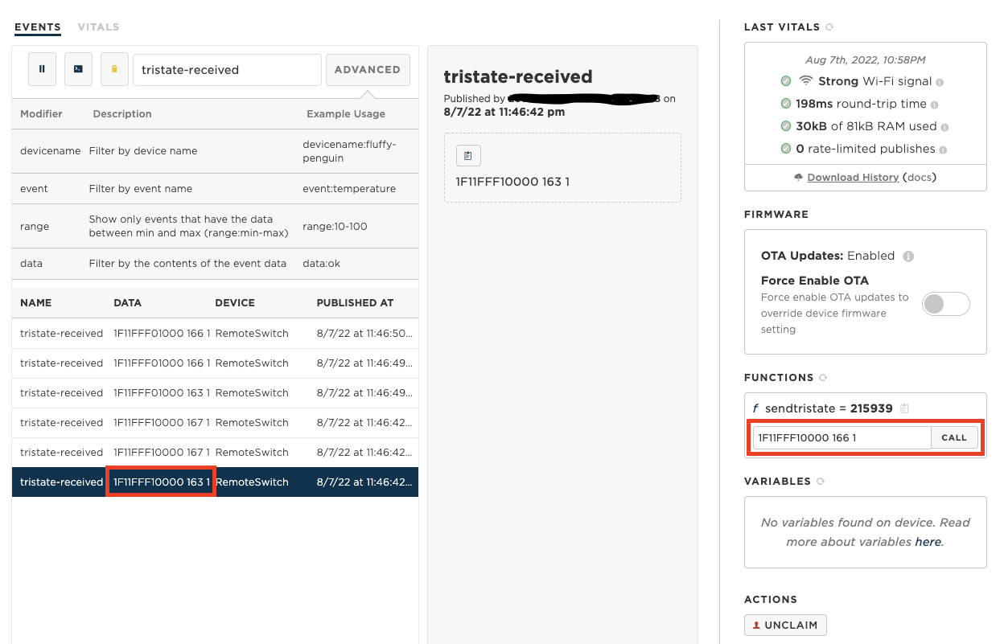
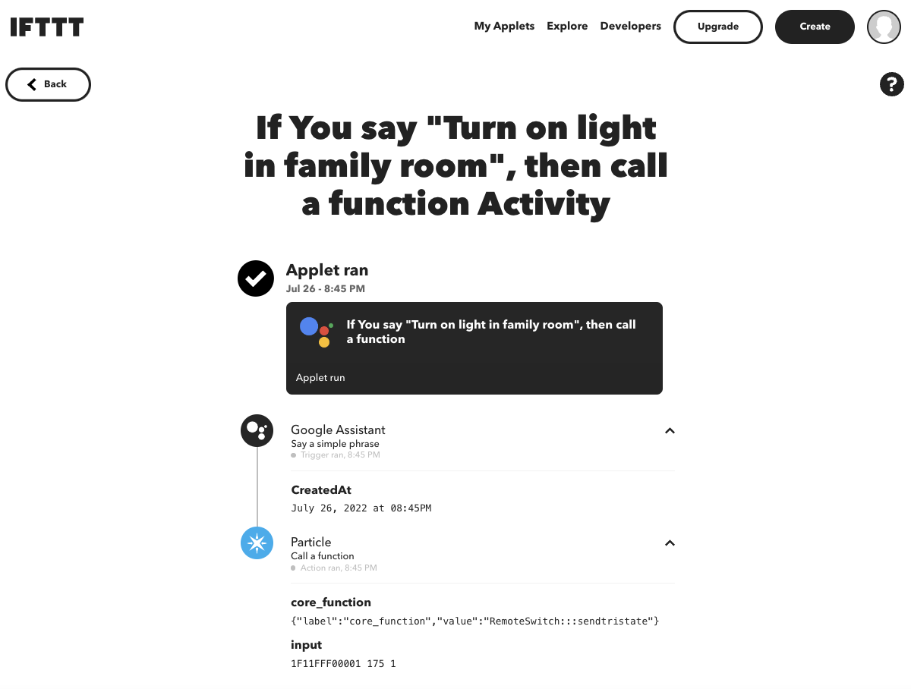
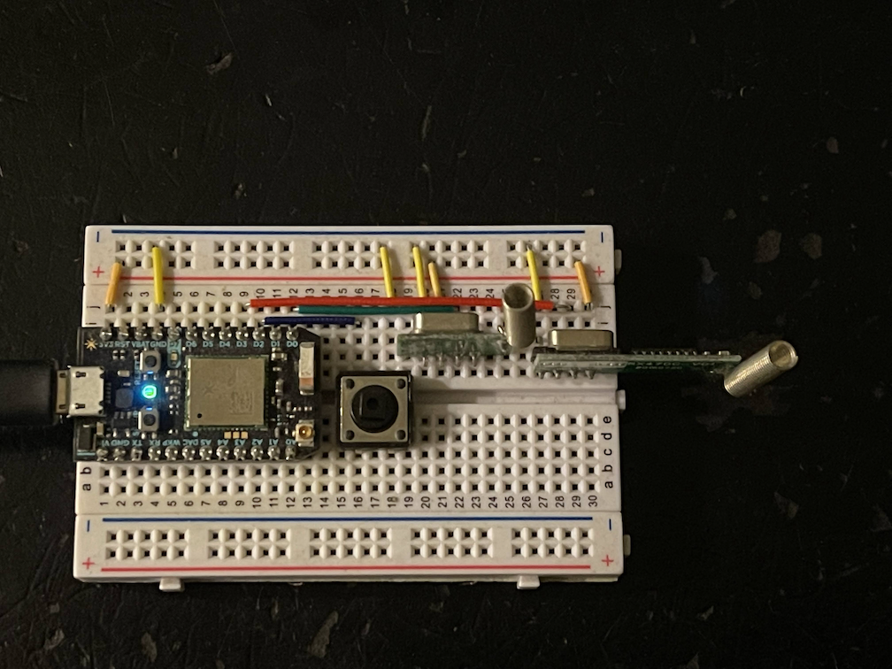
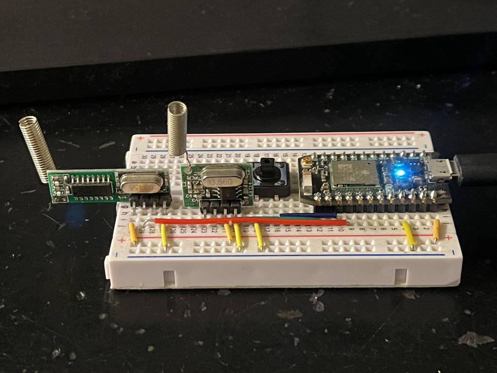
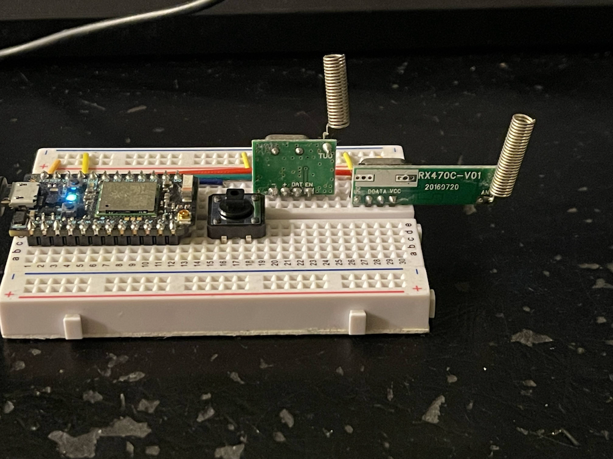
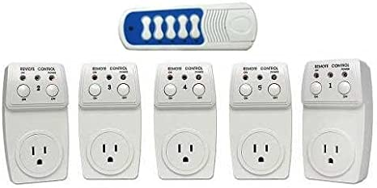

# Google Assistant controlled Remote Switch

## Remote Control for RF 433MHz RC Outlet Switch using [Particle Photon](https://docs.particle.io/photon/)

The code could support most of the RF 433MHz RC Switch. To setup the switch:

* Build and flash the code to Photon
* Go to [Particle devices console](https://console.particle.io/devices), click on the Photon device and go to the device page. (See screenshot below.)
* Press a button on the Remote Control, the Photon RF receiver wlll decode the RF signal into tristate code and publish it to the device console.
* Find the tristate-received event and copy the data string. E.g. `1F11FFF10000 162 1`
* Paste the tristate code string to the input box for function *f* `sendtristate`, then click the "CALL" button
* When Photon received the function call with the tristate code, it will replay the RF signal using the RF transmitter.
* The Switch will toggle when receive the signal.



## Integrate with Google Assistant using [IFTTT](https://ifttt.com/)

* Go to [IFTTT](https://ifttt.com/) and create an IFTTT Applet
* Set IF condition to 'Say a simple phrase'. E.g. "Turn on light in family room"
* Set Action to call Particle function. `{"label":"core_function","value":"RemoteSwitch:::sendtristate"}`
* Set Input to the tristate code string. e.g. `1F11FFF00001 175 1`
* Now say the phrase to Google Assistant and the Photon will response and toggle the switch.



## Button Control

The big black button on the breadboard can be used to control the remote switch. 
The tristate codes is hard coded in the source code as below. Single click the button toggle the first switch,
double click toggle the second switch, triple click toggle the third switch, etc.
If the n click then hold, it will toggle the first n switches.
E.g. click, click, hold will toggle the first 3 switches
```
static const char* kSwitchCodes[] {
  "1F11FFF00001 165 1",
  "1F11FFF00010 165 1",
  "1F11FFF00100 165 1",
  "1F11FFF01000 165 1",
  "1F11FFF10000 165 1",
};
```

## HW setup

* D0 connect to the RF433 transmitter Data Pin
* D2 connect to one pin of the push button, the other pin of the push button connect to GND
* D3 connect to the RF433 receiver Data Pin








## RC Switch

[](https://www.amazon.com/dp/B0065PASNI/ref=pe_309540_26725410_item)
