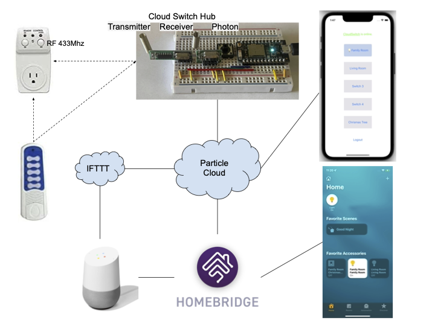
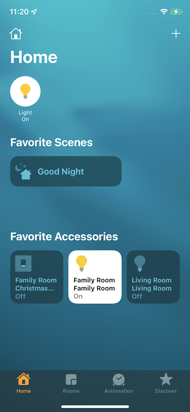
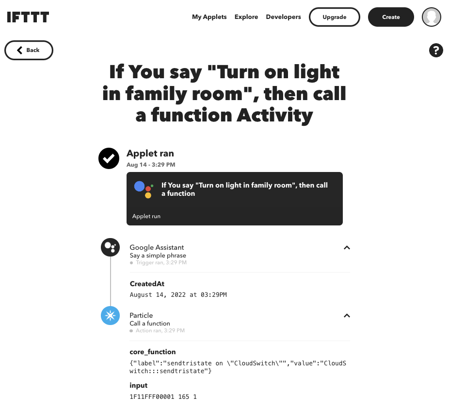

# Cloud Switch

Cloud Swtich turns a RF 433MHz/315MHz Remote Control Switch Outlet into a Smart Swtich that can be
controlled over internet using cell phone app, Apple Home App/Siri or Google Assistant.

## How does it work

At the heart of the Cloud Switch is the Clould Switch Hub which make the RF controllable switches accessible
over the Internet. The Cloud Switch Hub is made of a [Paticl Photon](https://docs.particle.io/photon/),
an RF receiver module and an RF transmitter module.
The latest update added support to use TI CC1101 433MHz RF Wireless Transceiver Module.

1. When user press a button on the Remote Control, the Remote Control will send a radio signal
at the frequency about 433MHz. The signal is used to toggle the switch.
2. The RF receiver module decodes the radio signal and output tristate (H/L/Float) signal on the data pin.
3. Photon reads the output of data pin and convert it into tristate code then publish it to [partical cloud](https://www.particle.io/).
4. The app on the cell phone subscribes to the tristate code then assigns it to a button.
5. Later when user press the button in the app, the app can call the cloud function with the tristate code.
6. Phonon handle the cloud function and send the tristate signal to the data pin of the RF transmitter.
7. RF transmitter convert the tristate code back to the radio signal and toggle the switch.

## Build instructions

- Follow the README in [photon](./photon/) folder to setup the Cloud Switch Hub then build and flash the firmware.
- Follow the README in [iOS](./iOS/) folder to build the iOS app.

## Switch Configuration Sync

The latest firmware and iOS app support sync switch configurations between multiple iOS apps and the Cloud Switch Hub.
If you setup or update the switch configuration in one iOS app for a connected Cloud Switch device, the names and codes assigned to
the buttons will be sent to the connected Cloud Switch. The Cloud Switch will broadcast the configuration to all connected iOS apps.
If a new app log in and reconnected to the Cloud Switch, the switch configuration will be retrieved from the Cloud Switch.
The big black push button on the Cloud Switch board also use the same configuration to toggle switches.
Detail can be found in [photon README](./photon/README.md).

## Switch state tracking

The RF controlled Switch can only recieve the RF signal to toggle the switch. There is no way to retrieve the 
current on/off state of the switch. So the user must set the initial state of the switch. This could be done using
the iOS app or manually change the on/off state on the switch. After that, the Cloud Switch Hub can tracking the
state change by listening to RF contorl signal sent by physical remote or tracking the RF signal it sent out.
Switch state can be retrieved using cloud function or variable and state change will be published as a event.
Detail can be found in [photon README](./photon/README.md).

## Integration with Apple Home App through Homebridge

The Cloud Switch can be integrated with [Apple Home App](https://www.apple.com/home-app/) through the [Homebridge](https://homebridge.io/) with the [Homebridge Cloud Switch Plugin](https://github.com/jasompi/homebridge-plugin-cloud-switch).

1. Follow the [Homebridge installation intructions](https://github.com/homebridge/homebridge/wiki) to install Homebridge.
2. Follow the Homebridge Cloud Switch Plugin [Installation](https://github.com/jasompi/homebridge-plugin-cloud-switch#installation) and [Configuration](https://github.com/jasompi/homebridge-plugin-cloud-switch#configuration) to set up the Cloud Switch Plugin.
3. Pair the Homebridge with your Apple Home. After that the Cloud Switches setup in the iOS app will show up in Apple Home App.

## Integrate with Google Home/Assistant

There are two ways to integrate with Google Assistent: using the Homebridge [Google Smart Home Plugin](https://github.com/oznu/homebridge-gsh) or using the [IFTTT](https://ifttt.com/)

### Integrate using Homebridge Google Smart Home Plugin

If you setup the [Homebridge Cloud Switch Plugin](https://github.com/jasompi/homebridge-plugin-cloud-switch). Then you just need to install the [Homebridge Google Smart Home (GSH) Plugin](https://github.com/oznu/homebridge-gsh). In you Google Home App, add new device work with Google and search for Homebridge. After link the Homebridge, all Cloud Switch exposed in Homebridge will be availabe in Google Home App.

### Integrate using [IFTTT](https://ifttt.com/)

- Go to [IFTTT](https://ifttt.com/) and create an IFTTT Applet
- Set IF condition to 'Say a simple phrase'. E.g. "Turn on light in family room"
- Set Action to call Particle function. `{"label":"core_function","value":"RemoteSwitch:::sendtristate"}`
- Set Input to the tristate code string. e.g. `1F11FFF00001 165 1`
- Now say the phrase to Google Assistant and the Photon will response and toggle the switch.

