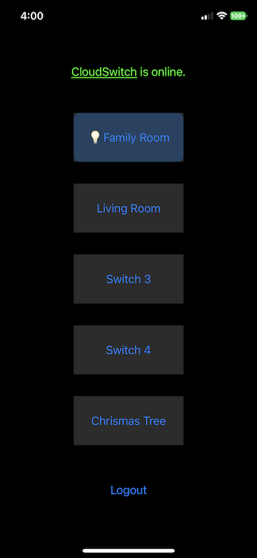

# Cloud Switch iOS App

The iOS app work as remote control for the [Cloud Switch](../). 

## Build instruction

Make sure [Cocopods](https://guides.cocoapods.org/using/getting-started.html) is installed.

1. `cd CloudSwitch/iOS`
2. `pod install`
3. `open CloudSwitch.xcworkspace/`
4. Build and Run in XCode

## Using the app

Make sure the particle device with [Cloud Switch](../photon) is setup and connected correctly.

1. Click login button, input credential for
   [particle.io](https://login.particle.io/login?redirect=https://console.particle.io)
   and login.
2. If you have multiple partical devices setup as Cloud Switch, select the one you want to used.
3. Buttons will be enabled if the Cloud Switch device is online. Long press a button to initiate
   learning switch code.
4. Press the button on the physical remote control to learn the code. The code will show up in the alert view.
5. Click assign to assign the code to the button. You can give the switch a differnt name.
6. Click the button will toggle the switch as if you press the button on the physical remote.
7. To change the name or code for a button, long press the button again.
8. To switch to a different Cloud Switch device, tap the Cloud Switch status label.

## Dependency:

* [Particle-SDK](https://github.com/particle-iot/particle-cloud-sdk-ios)
* [AFNetworking](https://github.com/AFNetworking/AFNetworking)

## Screenshots

  