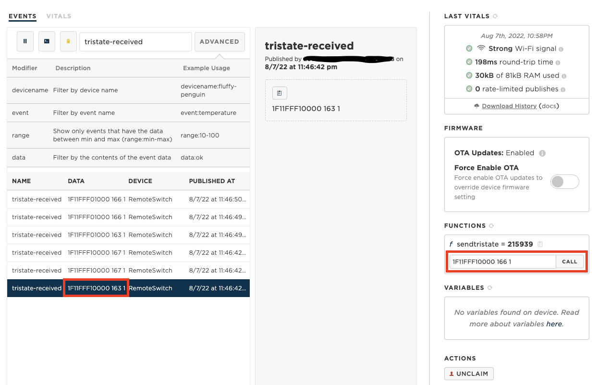
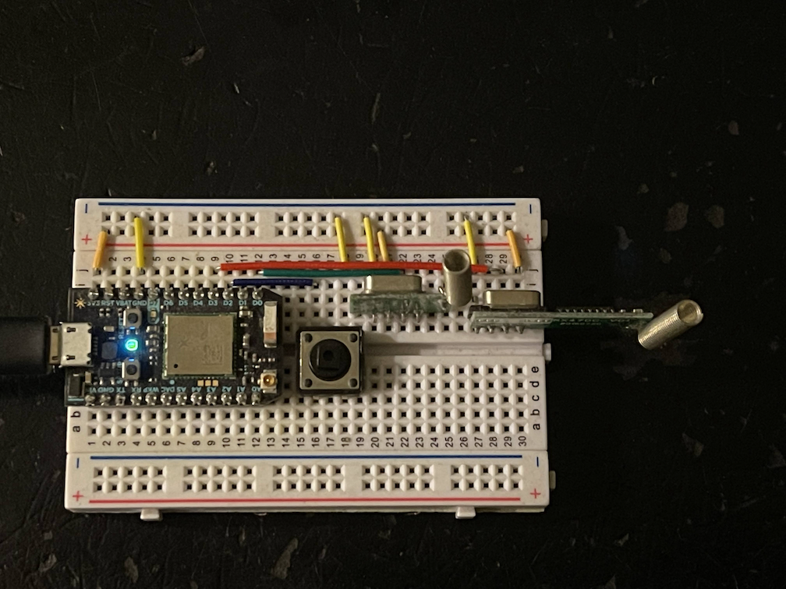
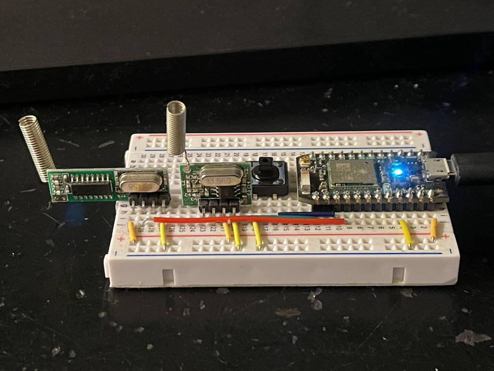
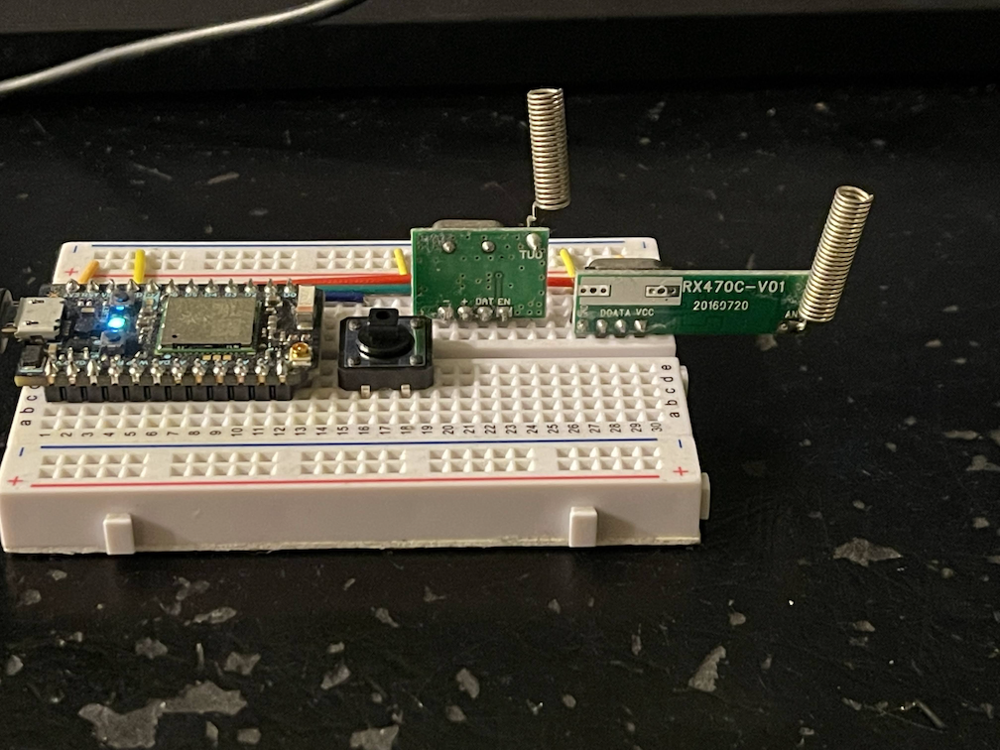

# Cloud Switch Photon Setup

## HW Setup

You can use Particle [Photon](https://store.particle.io/collections/wifi/products/photon)
or [Argon](https://store.particle.io/collections/wifi/products/argon).
Both 433MHz and 315MHz RF remoted control switches can be supported. 
The RF transmitter and receiver can be purchased from 
[ebay](https://www.ebay.com/sch/i.html?_from=R40&_trksid=p2334524.m570.l1313&_nkw=315+433+mhz+rf+transmitter+and+receiver+with+antenna&_sacat=0&LH_TitleDesc=0&_odkw=433+mhz+rf+transmitter+and+receiver+with+antenna&_osacat=0&LH_PrefLoc=2).

- 3.3v conntect to VCC/BAT/+ of transmitter and receiver
- GND connect to GND/- of transmitter and receiver
- D0 connect to the Data Pin of transmitter
- D3 connect to the Data Pin of receiver

Push Button is optional.

- D2 connect to pin on one end of the  button.
- GND connect to pin on the other end of the button.

Refer to the pictures below:

## Photon Setup

Follow the instructions at [Connect Your Photon](https://docs.particle.io/quickstart/photon/#connect-your-photon)
to setup the devices. You need to sign up for a partile.io account and claim the device and set a name to the device.
The name will be used in the [Configure for Device](#build-and-flash) step below.

## Install IDE

Follow the instructions at [Quick start: Workbench](https://docs.particle.io/quickstart/workbench/)
to install the IDE (VS Code + Particle Workbench).

## Build and flash

- Open the projects.
- Open Particle Workbench and click "Login" to login to Particle account.
- Click "Configure for Device" under Development Workflow -> TARGET
- Choose deviceOS@3.3.0 -> photon then input the name of the device
- Click "Local compile" to compile the code. 
  (Cloud compilation will fail due to error in the RCSwitch library which is fixed locally.)
- Connect the photon over USB, click "Local flash". The LED on Photon will blinking then breath.

## Try it

- Press any button on the Remote Control, the blue LED will light up for a second. 
  This indicates a RF code is received and the FW is working correctly. 
- Go to [Particle devices console](https://console.particle.io/devices), click on the Photon device and go to the device page. (See screenshot below.)
- Press a button on the Remote Control, the Photon RF receiver wlll decode the RF signal into tristate code and publish it to the device console.
- Find the tristate-received event and copy the data string. E.g. `1F11FFF10000 162 1`
- Paste the tristate code string to the input box for function *f* `sendtristate`, then click the "CALL" button
- When Photon received the function call with the tristate code, it will replay the RF signal using the RF transmitter.
- The Switch will toggle when receive the signal.

Now you can run the [Cloud Swtich iOS app](../ios) to setup and control the Cloud Swtiches using your phone.

## Button Control

The big black button on the breadboard can be used to toggle the switches. After you assign the tristate
codes to the buttons in the iOS app, the configuration for the five buttons will be sent to the photons.
If you click the button, Cloud Switch will send the tristate code to toggle the switch same as you press the button
in the phone app. Single click the button toggle the first switch, double click toggle the second switch,
triple click toggle the third switch, etc. If the N click then hold, it will toggle the first n switches.
E.g. click, click, hold will toggle the first 3 switches

## Dependency:

- [RCSwitch](https://github.com/suda/rcswitch)
- [clickButton](https://github.com/pkourany/clickButton)

## HW pictures

